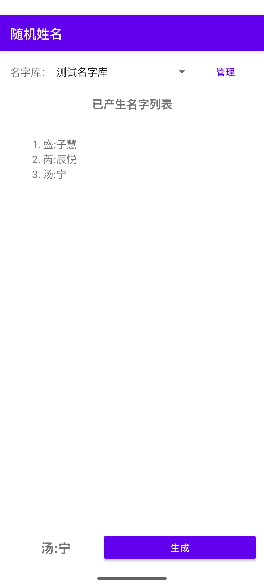

# 随机姓名 Random Name

随机中文姓名生成器 — Android 客户端。

从姓氏库（百家姓）中选取姓氏，从名字用字库中组合名字，支持多字库切换和自定义管理。

## 功能

- **随机生成** — 随机选取姓氏（百家姓）+ 1~2 字名
- **字库管理** — 多字库切换、新建、导入、重命名、删除，自动记忆

## 截图



## 构建

```bash
git clone git@github.com:qux-bbb/random-name-android.git
cd random-name-android
./gradlew assembleDebug
```

需要 Android SDK 35 + JDK 17。

## 字库文件格式

导入或新建名字库时，文件内容应为空格分隔的汉字：

```
伟 强 芳 婷 娜 琳 琪 瑶 璐 莹
```

文件需为 UTF-8 编码，每一组文字之间用空格隔开。

## 许可证

GNU General Public License v3.0 or later

See [LICENSE](LICENSE) for details.
